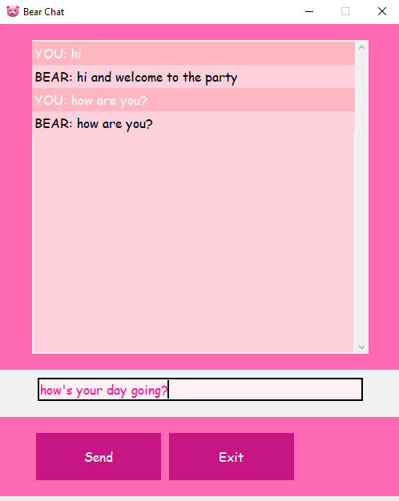

# Bear-Chatbot-py

A friendly chatbot built using Python, Tkinter, and the DialoGPT model from the Transformers library. This chatbot, named Bear, uses natural language processing to engage in interactive conversations with users through a GUI interface.



## Features

- **Friendly Chatbot**: Powered by the DialoGPT model for generating human-like responses.
- **Interactive GUI**: Built with Tkinter for an easy-to-use graphical interface.
- **Message Display**: User messages are shown in light pink, and chatbot responses are shown in soft peach.
- **Smooth Scrolling**: Chat messages are displayed in a scrollable window.
- **Customizable Interface**: A vibrant, pink-themed UI to give the chatbot a fun and approachable look.
- **Exit Confirmation**: A confirmation dialog to safely exit the chat.

## Technologies Used

- **Python 3.x**: The core language for developing the application.
- **Tkinter**: For creating the graphical user interface (GUI).
- **Hugging Face Transformers**: To load and interact with the DialoGPT model for text generation.
- **Pillow**: For handling images, including setting a custom icon for the application.
- **Torch**: Backend library required for running the DialoGPT model.

## Installation

### Prerequisites

Ensure you have Python 3.x installed. You can download it from [here](https://www.python.org/downloads/).

### Steps to Install

1. **Clone the Repository**:
    ```bash
    git clone https://github.com/your-username/Bear-Chatbot-py.git
    cd Bear-Chatbot-py
    ```

2. **Install Required Libraries**:
    ```bash
    pip install transformers torch tkinter Pillow
    ```

3. **Add a Custom Icon (Optional)**:
    Place your custom logo image (`logo.png`) inside an `assets` folder within the project directory to set it as the app icon.

4. **Run the Application**:
    ```bash
    python app.py
    ```

## Usage

When you run the app, a Tkinter window will pop up with an interactive chat interface.

- Type your message into the input box and press **Send**. The chatbot (Bear) will generate a response.
- If you wish to exit the application, click **Exit**, and a confirmation dialog will appear.

## Customization

- **Chatbot Responses**: You can fine-tune the DialoGPT model to better match your chatbot’s personality.
- **Interface Customization**: The GUI colors and fonts are adjustable in the code to suit your style.

## Contributing

Feel free to fork the repository, create pull requests, and contribute to enhancing Bear-Chatbot-py.

## License

This project is licensed under the **MIT License**.
